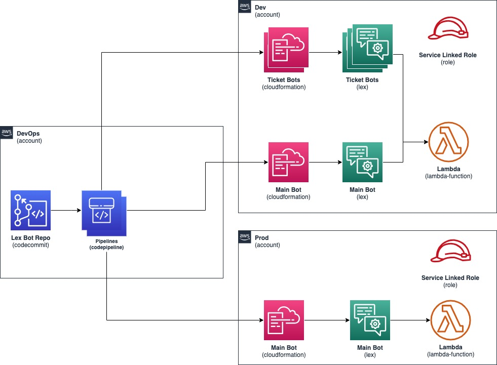

## Management Framework Sample for Amazon Lex

This repository contains an automated workflow for developing and deploying Amazon Lex bots using infrastructure as code principles. The workflow aims to streamline the process of managing multiple features, developers, and environments for Lex bots.

## Key Features

- **Concurrent Development**: Enables developers to work on different features in parallel using separate branches.
- **Lex Console Integration**: Allows developers to leverage the user-friendly Lex console for building and testing bots, while storing bot definitions in infrastructure code for deployment.
- **Environment Promotion**: Automates the promotion of bot versions across development, testing, and production environments, reducing the risk and overhead of manual promotions.
- **Version Control**: Stores bot definitions in Git, providing version control and an audit trail for changes made by individual developers.

## Architecture



## Repository Structure

```
lex-management-workflow/
├── prerequisite/
│    ├── lexmgmtworkflow/
│        ├── lexmgmtcrossaccountrole_stack.py
│        ├── lexmgmtdevopsrole_stack.py
│        └── lexmgmtworkflow_stack.py
├── tests/
│   └── unit/
│       ├── test_lexmgmtworkflow_stack.py
│   └── .gitignore
│   ├── app.py
│   ├── cdk.json
│   ├── package-lock.json
│   ├── package.json
│   ├── requirements-dev.txt
│   ├── requirements.txt
└── src/
    ├── lex_manager.py
    ├── lex_utils_v2.py
    ├── requirements.txt
    ├── template.yaml
    ├── .gitignore
    └── README.md
```

- `prerequisite/`: Contains CloudFormation stack definitions (using AWS CDK) for setting up required resources and environments.
- `lexmgmtworkflow/`: Main directory for the Lex Management Workflow project, including stack definitions and Python code.
- `tests/`: Contains unit tests for the project.
- `src/`: Source code directory, including Lex bot management wrapper and utilities.
- Other files: Configuration files, dependencies, and documentation.

## Getting Started

1. Clone the repository
2. Install dependencies: `pip install -r requirements.txt`
3. Set up the required AWS accounts and environments according to the documentation.
4. Deploy the Cross Account role stacks: 
    - `cdk bootstrap --profile=devops`
    - `cdk deploy LexMgmtDevopsRoleStack -c dev-account-id=2222222222222 -c prod-account-id=333333333333 --profile=devops`
5. Deploy the Cross Account role stacks: 
    - `cdk bootstrap --profile=dev`
    - `cdk deploy LexMgmtCrossaccountRoleStack -c devops-account-id=1111111111111 --profile=dev`
    - `cdk bootstrap --profile=prod`
    - `cdk deploy LexMgmtCrossaccountRoleStack -c devops-account-id=1111111111111 --profile=prod`
6. Deploy the main Lex Management Workflow stack: 
    - `cdk deploy LexMgmtWorkflowStack -c devops-account-id=1111111111111 -c dev-account-id=2222222222222 -c prod-account-id=333333333333 --profile=devops`
7. Follow the workflow steps to develop, test, and promote Lex bots across environments.
    - Step 1: Baseline Main Bot
    - Step 2: Create Ticket Bot
    - Step 3: Export Ticket Bot
    - Step 4: Rebase branch from Main
    - Step 5: Import rebased Ticket Bot and validate
    - Step 6: Raise PR and Merge to Main
    - Step 7: Delete Ticket Bot
    - Step 8: Import Main Bot into higher environments

Refer to the documentation for detailed instructions on configuring and using the workflow.

## Security

See [CONTRIBUTING](CONTRIBUTING.md#security-issue-notifications) for more information.

## License

This library is licensed under the MIT-0 License. See the LICENSE file.

